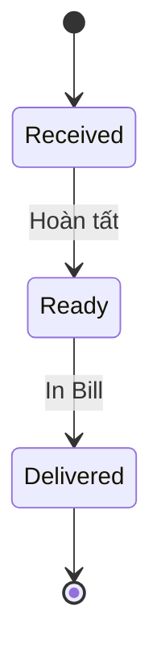

# Ứng dụng Quản lý Giặt – Sấy “Lite • One Device • Offline-First”
**Đặc tả yêu cầu hệ thống – Phiên bản 2.0 (24 / 06 / 2025)**  

---

## Mục lục
1. [Mục tiêu & Phạm vi](#1-mục-tiêu--phạm-vi)  
2. [Diễn viên & Thiết bị](#2-diễn-viên--thiết-bị)  
3. [Quy trình nghiệp vụ](#3-quy-trình-nghiệp-vụ)  
4. [Yêu cầu chức năng](#4-yêu-cầu-chức-năng-fr)  
5. [Yêu cầu phi chức năng](#5-yêu-cầu-phi-chức-năng-nfr)  
6. [Mô hình dữ liệu](#6-mô-hình-dữ-liệu-cốt-lõi-sqlite)  
7. [Giao diện người dùng](#7-giao-diện-người-dùng-ui)  
8. [In ấn ESC/POS](#8-in-ấn-escpos)  
9. [Backup & Khôi phục](#9-offline-backup--khôi-phục)  
10. [Kiểm thử chấp nhận](#10-kiểm-thử-chấp-nhận-uat)  
11. [Kế hoạch phát triển](#11-kế-hoạch-phát-triển-10-tuần)  
12. [Rủi ro & Biện pháp](#12-rủi-ro-chính--biện-pháp)  
13. [Hạng mục cần xác nhận](#13-hạng-mục-cần-xác-nhận)  
24. [Giao diện các màn hình](#14-giao-diện-các-màn-hình)
---

## 1. Mục tiêu & Phạm vi
| Mục tiêu                                | Giới hạn                                                      |
|-----------------------------------------|---------------------------------------------------------------|
| **Tự động hoá quy trình nhận → giao đồ** với **3 trạng thái**: `Received → Ready → Delivered`. | Một cửa hàng, **một** điện thoại Android, **một** máy in Bluetooth. |
| **Tra cứu & chăm sóc khách nhanh**      | Tìm theo **tên hoặc 4 số cuối SDT**; KH mới được **tạo tự động**. |
| **In tem & hoá đơn nhiệt**              | Chuẩn ESC/POS, khổ 58 / 80 mm.                                |
| **Hoạt động hoàn toàn offline**         | Lưu cục bộ SQLite; **chưa** đồng bộ cloud trong MVP.<br>(Cờ *EnableCloudSync* cho phase 2) |
| **Tùy chọn Loyalty**                    | Điểm tích luỹ, quy đổi giảm giá; có thể tắt trong Settings.   |

---

## 2. Diễn viên & Thiết bị
| Đối tượng                    | Vai trò                                          |
|------------------------------|--------------------------------------------------|
| **User** (chủ / thu ngân)    | Thực hiện mọi thao tác trên app                   |
| **Bluetooth Printer**        | In tem nhận đồ & hoá đơn thanh toán              |
| **(Tương lai) Cloud Sync API** | Nhận & trả dữ liệu khi cờ *EnableCloudSync* bật |

---

## 3. Quy trình nghiệp vụ


| Bước          | Thao tác User                                                                                                                                           | Xử lý hệ thống                                                                                                                                 |
| ------------- | ------------------------------------------------------------------------------------------------------------------------------------------------------- | ---------------------------------------------------------------------------------------------------------------------------------------------- |
| **Received**  | • Gõ tên / 4 số SDT → chọn KH hoặc nhập SDT mới (app hỏi thêm **Tên**).<br>• Nhập kg, chọn dịch vụ, (tuỳ chọn) ghi vật liệu.<br>• Bấm **Lưu & In tem**. | • Tự tạo KH mới nếu SDT chưa tồn tại.<br>• Sinh `orderCode` `GS-YYMMDD-NNN`.<br>• Ghi Order (`status = RECEIVED`).<br>• Trả ESC/POS để in tem. |
| **Ready**     | Vuốt phải đơn *Received* → **Hoàn tất**                                                                                                                 | Update `status = READY`; (nếu Loyalty ON) cộng điểm                                                                                            |
| **Delivered** | Mở đơn *Ready* → **In Bill**                                                                                                                            | Ghi Payment → `status = DELIVERED`; trả ESC/POS để in bill                                                                                     |

> **Chú ý**: Không có SMS trong MVP; tích hợp Zalo OA ở phase 2.

---

## 4. Yêu cầu chức năng (FR)

| Mã    | Chức năng              | Đặc tả                                                                    | Ưu tiên    |           |      |
| ----- | ---------------------- | ------------------------------------------------------------------------- | ---------- | --------- | ---- |
| FR-01 | Đăng nhập “1 thiết bị” | Tài khoản email + OTP SMS; đăng nhập thiết bị mới ⇒ thiết bị cũ tự logout | Must       |           |      |
| FR-02 | Quản lý Khách hàng     | `phone` UNIQUE, `name` **bắt buộc**; tìm SDT / tên không dấu              | Must       |           |      |
| FR-03 | Customer Picker        | Auto-complete TOP 10 KH gần nhất; KH mới → yêu cầu nhập `name`            | Must       |           |      |
| FR-04 | CRUD Dịch vụ           | Tên, đơn giá/kg, SLA mặc định (phút)                                      | Must       |           |      |
| FR-05 | Tạo Order & In Tem     | Payload: `phone`, `name?`, `weight`, `serviceTypeId`, `materialNote?`     | Must       |           |      |
| FR-06 | Hoàn tất đơn           | `PUT /orders/{id}/complete` → cập nhật `status = READY`                   | Must       |           |      |
| FR-07 | Thanh toán & In Bill   | `POST /payments` → lưu Payment, `status = DELIVERED`, trả ESC/POS bill    | Must       |           |      |
| FR-08 | Loyalty (ON/OFF)       | Earn = ⌊total/1000⌋; redeem ≤ 30% tổng hóa đơn; 1 đ = 100 đ               | Should     |           |      |
| FR-09 | Báo cáo                | Doanh thu ngày/tuần/tháng; thời gian xử lý; Top KH                        | Must       |           |      |
| FR-10 | Offline-first DB       | Mọi bảng có trường `syncState` (`NEW`                                     | `MODIFIED` | `SYNCED`) | Must |
| FR-11 | Cloud Sync (tương lai) | Worker chạy 22:30: push diff & pull lookup; policy *last-write-wins*      | Future     |           |      |

---

## 5. Yêu cầu phi chức năng (NFR)

| Nhóm                 | Chỉ số                                            |
| -------------------- | ------------------------------------------------- |
| **Hiệu năng**        | p95 chuyển trạng thái < 2 s; in tem < 3 s         |
| **Dung lượng**       | DB SQLite ≤ 200 MB (\~30 000 đơn)                 |
| **Bảo mật**          | AES-256 at rest; JWT HS512; TLS1.3 cho Sync API   |
| **Khả dụng offline** | 100% nghiệp vụ chính chạy khi mất mạng            |
| **Mở rộng**          | Bật *EnableCloudSync* mà không thay đổi schema DB |

---

## 6. Mô hình dữ liệu cốt lõi (SQLite)

```sql
CREATE TABLE Customer (
  id UUID PRIMARY KEY,
  phone TEXT UNIQUE NOT NULL,
  name TEXT NOT NULL,
  createdAt DATETIME,
  updatedAt DATETIME,
  totalPoints INTEGER DEFAULT 0,
  syncState TEXT DEFAULT 'NEW'
);

CREATE TABLE ServiceType (
  id UUID PRIMARY KEY,
  name TEXT,
  pricePerKg REAL NOT NULL,
  defaultSLAmin INTEGER,
  syncState TEXT DEFAULT 'NEW'
);

CREATE TABLE "Order" (
  id UUID PRIMARY KEY,
  orderCode TEXT UNIQUE,
  customerId UUID,
  serviceTypeId UUID,
  weightKg REAL,
  materialNote TEXT,
  pricePerKg REAL,
  subtotal REAL,
  discount REAL DEFAULT 0,
  total REAL,
  status TEXT CHECK(status IN ('RECEIVED','READY','DELIVERED')),
  createdAt DATETIME,
  updatedAt DATETIME,
  syncState TEXT DEFAULT 'NEW'
);

CREATE TABLE Payment (
  id UUID PRIMARY KEY,
  orderId UUID,
  amount REAL,
  method TEXT CHECK(method IN ('CASH','DEBT')),
  paidAt DATETIME,
  syncState TEXT DEFAULT 'NEW'
);

CREATE TABLE LoyaltyTxn (
  id UUID PRIMARY KEY,
  customerId UUID,
  orderId UUID,
  pointsEarned INTEGER,
  pointsRedeemed INTEGER,
  createdAt DATETIME,
  syncState TEXT DEFAULT 'NEW'
);
```

---

## 7. Giao diện người dùng (UI)

### 7.1 Dashboard

* **Đơn chờ** (Received), **Đơn sẵn sàng** (Ready), **Doanh thu hôm nay**
* Kéo xuống để refresh dữ liệu từ SQLite.

### 7.2 New Order

| Trường           | Hành vi                                                                         |
| ---------------- | ------------------------------------------------------------------------------- |
| **Search KH**    | Nhập ≥ 2 ký tự SDT/tên → dropdown TOP 10; nếu không tìm thấy → yêu cầu nhập tên |
| **Kg**           | Numeric, bước 0.1 (0.1 ≤ kg ≤ 50)                                               |
| **Dịch vụ**      | Bottom-sheet chọn ServiceType                                                   |
| **Vật liệu**     | Ẩn/hiện theo cài đặt *RequireMaterial*                                          |
| **Lưu & In tem** | Enable khi đủ dữ liệu bắt buộc                                                  |

### 7.3 Danh sách đơn

* Tab *Received*: vuốt phải → **Hoàn tất**
* Tab *Ready*: chọn đơn → **In Bill**

---

## 8. In ấn ESC/POS

* **Kết nối**: Bluetooth SPP 9600 bps, charset CP-858
* **Tem 58 mm**: Shop (bold-size2) • Mã đơn • KH • Dịch vụ • Kg • Vật liệu • Barcode CODE128
* **Bill 80 mm**: Tiêu đề shop, chi tiết tiền, điểm tích luỹ, lời cảm ơn
* Thư viện RN: `esc-pos-encoder` + `react-native-bluetooth-classic`

---

## 9. Offline Backup & Khôi phục

| Tính năng           | Mô tả                                                   |
| ------------------- | ------------------------------------------------------- |
| **Backup thủ công** | Xuất `.zip` DB → Google Drive hoặc bộ nhớ ngoài qua UI  |
| **Nhắc backup**     | Local notification sau 7 ngày nếu chưa thực hiện backup |

---

## 10. Kiểm thử chấp nhận (UAT)

| TC    | Kịch bản                        | Kết quả mong đợi                           |
| ----- | ------------------------------- | ------------------------------------------ |
| TC-01 | Tạo KH mới + Order              | KH & Order tạo thành công; tem in < 3 s    |
| TC-02 | Quy trình đầy đủ (3 trạng thái) | RECEIVED → READY → DELIVERED               |
| TC-03 | Thiếu tên khi KH mới            | App cảnh báo, không cho lưu                |
| TC-04 | Offline 24 h                    | Vẫn tạo & in đơn; dữ liệu lưu đầy đủ       |
| TC-05 | Backup & Restore                | Khôi phục DB từ file `.zip` → dữ liệu khớp |

---

## 11. Kế hoạch phát triển (10 tuần)

| Sprint | Thời gian | Nội dung chính                            |
| ------ | --------- | ----------------------------------------- |
| 0      | 3 ngày    | Setup repo, schema SQLite, POC in ESC/POS |
| 1      | 2 tuần    | Customer Picker, Order CRUD, Tem ESC/POS  |
| 2      | 1 tuần    | Payment & Bill, Dashboard                 |
| 3      | 1 tuần    | Loyalty, Báo cáo thời gian xử lý          |
| 4      | 4 ngày    | Backup/Restore, QA, Play Internal Test    |
| *(+2)* | 2 tuần    | Module CloudSync (EnableCloudSync)        |

---

## 12. Rủi ro chính & Biện pháp

| Rủi ro                              | Biện pháp                                                |
| ----------------------------------- | -------------------------------------------------------- |
| Font tiếng Việt không hiển thị đúng | Test với 3 model máy in; fallback in bitmap nếu cần      |
| Mất/đổi thiết bị ⇒ mất DB           | Khuyến nghị backup thủ công `.zip` & hướng dẫn khôi phục |
| Nhập kg thủ công có sai số          | Cảnh báo nếu kg > 30 hoặc = 0; hỗ trợ phím tắt 0.5 kg    |

---

## 13. Hạng mục cần xác nhận

1. **Danh sách & giá dịch vụ** khởi tạo
2. **Logo & khổ giấy** (58 mm / 80 mm)
3. **Bật Loyalty** trong version 2.0 hay để phase 2

*Sau khi duyệt xong, nhóm dev sẽ khoá schema, hoàn tất wireframe Figma và bắt đầu Sprint 0.*

---

## 14. Giao diện các màn hình

**Ứng dụng Giặt – Sấy Lite • One Device (ASCII Sketches)**

---

### Dashboard

```
+----------------------------------------------------+
| Dashboard                                          |
+----------------------------------------------------+
| [Đơn chờ: 12] [Đơn sẵn sàng: 5] [Doanh thu: ₫...]  |
+----------------------------------------------------+
| Đơn gần đây:                                       |
| 1. GS-250624-001   Khách: 0912345678   3.5 kg      |
| 2. GS-250624-002   Khách: 0912345679   2.0 kg      |
| 3. ...                                             |
+----------------------------------------------------+
| [+] Tạo đơn mới                                    |
+----------------------------------------------------+
```

---

### New Order

```
+----------------------------------------------------+
| Đơn mới                                            |
+----------------------------------------------------+
| SĐT:      [__________]                             |
| Tên KH:   [__________]                             |
|  (gợi ý auto-complete kết quả KH cũ & mới)         |
|                                                    |
| Kg:       [___] kg                                 |
| Dịch vụ:  [Giặt + Sấy ▼]                           |
| Vật liệu:                                          |
| [______________________________]                   |
|                                                    |
|           [Lưu & In Tem]                           |
+----------------------------------------------------+
```

---

## Received List

```
+----------------------------------------------------+
| Đơn chờ                                            |
+----------------------------------------------------+
| > GS-250624-001   0912345678   3.5 kg  [Hoàn tất]  |
| > GS-250624-002   0912345679   2.0 kg  [Hoàn tất]  |
| > ...                                              |
+----------------------------------------------------+
```

---

## Ready List

```
+----------------------------------------------------+
| Đơn sẵn sàng                                       |
+----------------------------------------------------+
|  GS-250624-003   0912345680   4.0 kg  [In HĐ]      |
|  GS-250624-004   0912345681   1.5 kg  [In HĐ]      |
|  ...                                               |
+----------------------------------------------------+
```

---

## Settings

```
+----------------------------------------------------+
| Cài đặt                                            |
+----------------------------------------------------+
| Require Material: [ON/OFF]                         |
| Loyalty:         [ON/OFF]                          |
| Printer:         [Chọn Bluetooth]                  |
|                                                    |
| [Backup Database]                                  |
+----------------------------------------------------+
```

